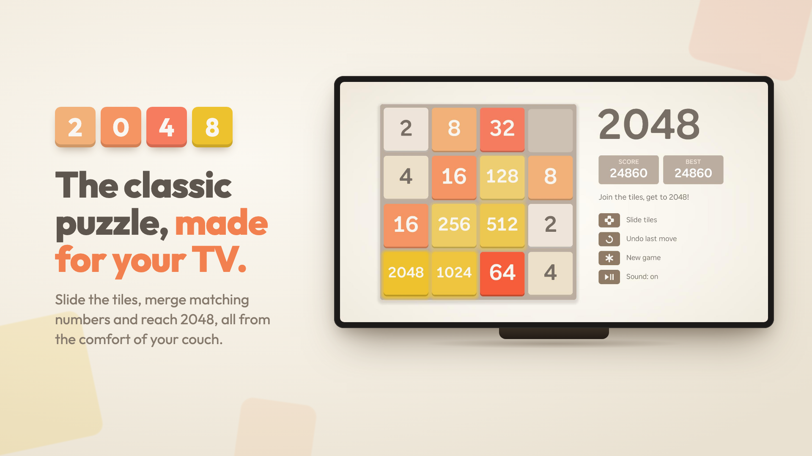

# 2048 for Roku

The classic 2048 puzzle as a Roku app. Slide the tiles with your remote, merge matching numbers, try to hit 2048.

> **Coming to the Roku Channel Store worldwide on Monday, September 28, 2026 at 10 AM PT.** It's free.



I wanted a version that felt good to play on a TV: quick animations that never make you wait, sounds that get more exciting as your tiles grow, and text that's actually sharp on the screen. It's also small (about 570 KB) and opens in about a second.

More info, plus the privacy policy and support page: **[2048.mistr.uk](https://2048.mistr.uk)**

## What's in it

- Snappy 100 ms slides. You can mash the arrows and it keeps up.
- Merges squish together and pop, with a little ring burst.
- Undo your last move with the Replay button, even after a game over.
- Saves after every move, so you can quit and come back to the same board.
- Native 720p and 1080p layouts. Nothing gets scaled, so everything stays crisp.
- No ads, no accounts, no network calls at all.

## Controls

| Button | Does |
|---|---|
| Arrows | Slide tiles |
| Replay ↺ | Undo |
| Options ✱ | New game |
| Play/Pause | Sound on/off |
| Back | Close a dialog or exit |

## Running it on your Roku

1. Turn on developer mode: on the remote press **Home ×3, Up ×2, Right, Left, Right, Left, Right**, then follow the prompts and set a password.
2. Build and sideload:

```sh
make install ROKU_IP=192.168.x.x ROKU_PASS=yourpassword
```

You can also run `make zip` and upload `out/roku2048.zip` at `http://<roku-ip>` in a browser.

`make console ROKU_IP=...` opens the BrightScript debug console if something breaks.

## How it's put together

It's plain BrightScript and SceneGraph, with no frameworks.

- `source/main.brs`: the entry point. Loads the saved game and handles Roku system events.
- `components/GameScene`: the game itself (board logic, input, layout, sounds).
- `components/Tile`: one tile. Tiles are pooled and reused, so nothing gets created mid-game.
- `components/Overlay`: the win, game over and "new game?" dialogs.
- `components/SaveTask`: writes your game to the registry on a background thread.
- `tools/gen_assets.py`: generates **every** image and sound in the app. It's just Python with no dependencies. Run `make assets` after changing it.
- `tools/promo/`: scripts that made the store screenshots.
- `site/`: the website at 2048.mistr.uk. It's a static Cloudflare Worker.

There's no test suite. I checked changes with the [BrighterScript](https://github.com/rokucommunity/brighterscript) compiler, Roku's static analysis tool (`make check`), and a lot of playing on real hardware.

One heads-up: the [brs-engine](https://lvcabral.com/brs/) web emulator is handy, but it doesn't behave like a real Roku in a few ways. It ignores some scaling options and creates scenes synchronously. At one point it hid a bug that stopped saves from working on actual devices, so test on hardware before trusting it.

## Credits

Based on the original [2048](https://github.com/gabrielecirulli/2048) by Gabriele Cirulli. The website and promo images use [Outfit](https://github.com/Outfitio/Outfit-Fonts) (SIL OFL). Roku is a trademark of Roku, Inc. This project isn't affiliated with Roku.

## License

MIT. See [LICENSE](LICENSE). Pull requests and forks are welcome.
